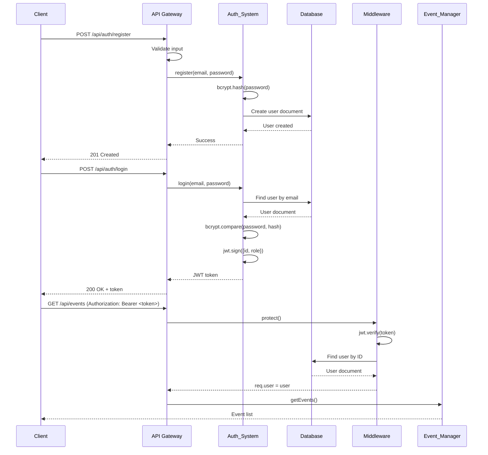
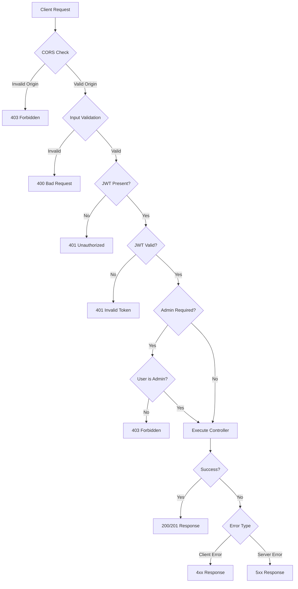
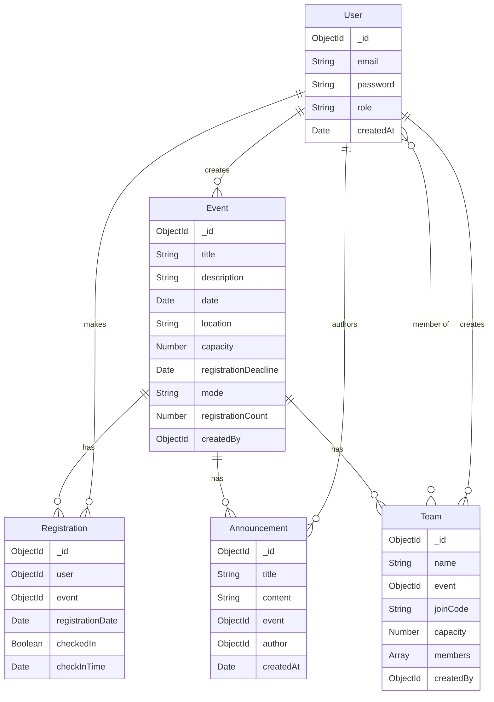

# Design Document: EventNexus Backend

## Overview

EventNexus is a RESTful API backend built with Node.js, Express, and MongoDB that provides comprehensive event management capabilities. The system implements JWT-based authentication, role-based access control, and supports the complete lifecycle of events from creation through registration, team formation, and announcements.

### Core Capabilities

- **Authentication & Authorization**: Stateless JWT authentication with bcrypt password hashing and role-based access control (admin/participant)
- **Event Management**: Full CRUD operations for events with capacity management, deadline enforcement, and mode support (online/offline)
- **Registration System**: Participant enrollment with capacity limits, deadline validation, and check-in tracking
- **Team System**: Team creation with unique join codes, capacity management, and member tracking
- **Announcement System**: Event-specific announcements with timestamp ordering
- **Administrative Dashboard**: Aggregated statistics for system monitoring and decision-making

### Design Principles

1. **Stateless Architecture**: JWT tokens enable horizontal scaling without session storage
2. **Separation of Concerns**: Clear boundaries between authentication, business logic, and data access layers
3. **Fail-Fast Validation**: Input validation at API gateway before business logic execution
4. **Centralized Error Handling**: Consistent error responses with appropriate status codes
5. **Data Integrity**: Schema validation at both application and database layers

## Architecture

### System Architecture

The EventNexus backend follows a layered architecture pattern:

```
┌─────────────────────────────────────────────────────────┐
│                    React Frontend                        │
└─────────────────────┬───────────────────────────────────┘
                      │ HTTP/REST + CORS
┌─────────────────────▼───────────────────────────────────┐
│                   API Gateway Layer                      │
│  ┌──────────────┐  ┌──────────────┐  ┌──────────────┐  │
│  │ CORS Config  │  │  Validation  │  │ Error Handler│  │
│  └──────────────┘  └──────────────┘  └──────────────┘  │
└─────────────────────┬───────────────────────────────────┘
                      │
┌─────────────────────▼───────────────────────────────────┐
│                 Middleware Layer                         │
│  ┌──────────────┐  ┌──────────────┐                     │
│  │   protect    │  │  adminOnly   │                     │
│  │ (JWT verify) │  │ (role check) │                     │
│  └──────────────┘  └──────────────┘                     │
└─────────────────────┬───────────────────────────────────┘
                      │
┌─────────────────────▼───────────────────────────────────┐
│                  Route Layer                             │
│  ┌──────┐ ┌──────┐ ┌──────┐ ┌──────┐ ┌──────┐          │
│  │ Auth │ │Event │ │ Reg  │ │ Team │ │ Ann  │          │
│  └──────┘ └──────┘ └──────┘ └──────┘ └──────┘          │
└─────────────────────┬───────────────────────────────────┘
                      │
┌─────────────────────▼───────────────────────────────────┐
│                Controller Layer                          │
│  ┌──────────────┐  ┌──────────────┐  ┌──────────────┐  │
│  │ Auth_System  │  │Event_Manager │  │  Team_Manager│  │
│  ├──────────────┤  ├──────────────┤  ├──────────────┤  │
│  │Registration_ │  │Announcement_ │  │Stats_Service │  │
│  │   System     │  │   System     │  │              │  │
│  └──────────────┘  └──────────────┘  └──────────────┘  │
└─────────────────────┬───────────────────────────────────┘
                      │
┌─────────────────────▼───────────────────────────────────┐
│                  Model Layer (Mongoose)                  │
│  ┌──────┐ ┌──────┐ ┌──────┐ ┌──────┐ ┌──────┐          │
│  │ User │ │Event │ │ Reg  │ │ Team │ │ Ann  │          │
│  └──────┘ └──────┘ └──────┘ └──────┘ └──────┘          │
└─────────────────────┬───────────────────────────────────┘
                      │
┌─────────────────────▼───────────────────────────────────┐
│                    MongoDB                               │
└──────────────────────────────────────────────────────────┘
```

### Folder Structure

```
eventnexus-backend/
├── config/
│   ├── db.js              # MongoDB connection with retry logic
│   └── jwt.js             # JWT configuration (secret, expiry)
├── models/
│   ├── User.js            # User schema with bcrypt hooks
│   ├── Event.js           # Event schema with validation
│   ├── Registration.js    # Registration schema
│   ├── Team.js            # Team schema with join code generation
│   └── Announcement.js    # Announcement schema
├── controllers/
│   ├── authController.js  # register, login
│   ├── eventController.js # CRUD operations
│   ├── regController.js   # register, cancel, checkIn
│   ├── teamController.js  # create, join, list
│   ├── annController.js   # create, list, delete
│   └── statsController.js # system and event statistics
├── middlewares/
│   ├── auth.js            # protect, adminOnly
│   ├── validate.js        # request validation schemas
│   └── errorHandler.js    # centralized error handling
├── routes/
│   ├── authRoutes.js
│   ├── eventRoutes.js
│   ├── regRoutes.js
│   ├── teamRoutes.js
│   ├── annRoutes.js
│   └── statsRoutes.js
├── utils/
│   ├── generateCode.js    # join code generation
│   └── logger.js          # logging utility
├── server.js              # Express app setup
└── index.js               # Entry point
```

### Authentication Flow



### Request Flow for Protected Endpoints



## Components and Interfaces

### Core Components

#### 1. Auth_System (authController.js)

**Responsibilities:**
- User registration with password hashing
- User authentication with JWT generation
- Password validation

**Key Methods:**
```javascript
register(req, res, next)
  Input: { email: string, password: string }
  Output: { success: boolean, message: string }
  
login(req, res, next)
  Input: { email: string, password: string }
  Output: { success: boolean, token: string, user: { id, email, role } }
```

#### 2. Event_Manager (eventController.js)

**Responsibilities:**
- Event CRUD operations
- Capacity and deadline enforcement
- Registration count tracking

**Key Methods:**
```javascript
createEvent(req, res, next)
  Input: { title, description, date, location, capacity, deadline, mode }
  Output: { success: boolean, event: Event }
  
getEvents(req, res, next)
  Input: { mode?: string, startDate?: Date, endDate?: Date }
  Output: { success: boolean, events: Event[] }
  
getEventById(req, res, next)
  Input: { id: string }
  Output: { success: boolean, event: Event }
  
updateEvent(req, res, next)
  Input: { id: string, updates: Partial<Event> }
  Output: { success: boolean, event: Event }
  
deleteEvent(req, res, next)
  Input: { id: string }
  Output: { success: boolean, message: string }
```

#### 3. Registration_System (regController.js)

**Responsibilities:**
- Participant registration with validation
- Registration cancellation
- Check-in management

**Key Methods:**
```javascript
registerForEvent(req, res, next)
  Input: { eventId: string }
  Output: { success: boolean, registration: Registration }
  
cancelRegistration(req, res, next)
  Input: { eventId: string }
  Output: { success: boolean, message: string }
  
checkInParticipant(req, res, next)
  Input: { eventId: string, userId: string }
  Output: { success: boolean, registration: Registration }
  
getEventRegistrations(req, res, next)
  Input: { eventId: string }
  Output: { success: boolean, registrations: Registration[] }
```

#### 4. Team_Manager (teamController.js)

**Responsibilities:**
- Team creation with join code generation
- Team joining with validation
- Member tracking

**Key Methods:**
```javascript
createTeam(req, res, next)
  Input: { name: string, eventId: string, capacity: number }
  Output: { success: boolean, team: Team }
  
joinTeam(req, res, next)
  Input: { joinCode: string }
  Output: { success: boolean, team: Team }
  
getEventTeams(req, res, next)
  Input: { eventId: string }
  Output: { success: boolean, teams: Team[] }
  
deleteTeam(req, res, next)
  Input: { teamId: string }
  Output: { success: boolean, message: string }
```

#### 5. Announcement_System (annController.js)

**Responsibilities:**
- Announcement creation
- Announcement retrieval with ordering
- Announcement deletion

**Key Methods:**
```javascript
createAnnouncement(req, res, next)
  Input: { title: string, content: string, eventId: string }
  Output: { success: boolean, announcement: Announcement }
  
getEventAnnouncements(req, res, next)
  Input: { eventId: string }
  Output: { success: boolean, announcements: Announcement[] }
  
deleteAnnouncement(req, res, next)
  Input: { announcementId: string }
  Output: { success: boolean, message: string }
```

#### 6. Stats_Service (statsController.js)

**Responsibilities:**
- System-wide statistics aggregation
- Event-specific statistics

**Key Methods:**
```javascript
getSystemStats(req, res, next)
  Output: { 
    totalUsers: number,
    totalEvents: number,
    totalRegistrations: number,
    totalTeams: number
  }
  
getEventStats(req, res, next)
  Input: { eventId: string }
  Output: {
    registrationCount: number,
    teamCount: number,
    checkInCount: number
  }
```

### Middleware Components

#### 1. protect (middlewares/auth.js)

**Purpose:** Verify JWT token and attach user to request

```javascript
protect(req, res, next)
  - Extract token from Authorization header
  - Verify token signature and expiration
  - Load user from database
  - Attach user to req.user
  - Call next() or throw 401
```

#### 2. adminOnly (middlewares/auth.js)

**Purpose:** Verify user has admin role

```javascript
adminOnly(req, res, next)
  - Check req.user.role === 'admin'
  - Call next() or throw 403
```

#### 3. validate (middlewares/validate.js)

**Purpose:** Validate request payloads against schemas

```javascript
validate(schema)
  - Returns middleware function
  - Validates req.body against schema
  - Returns 400 with field errors or calls next()
```

#### 4. errorHandler (middlewares/errorHandler.js)

**Purpose:** Centralized error handling

```javascript
errorHandler(err, req, res, next)
  - Log error with stack trace
  - Determine status code (4xx vs 5xx)
  - Return sanitized error response
  - Hide internal details in production
```

### API Endpoints

#### Authentication Routes
```
POST   /api/auth/register    - Register new user
POST   /api/auth/login       - Login and get JWT token
```

#### Event Routes
```
POST   /api/events           - Create event (admin)
GET    /api/events           - Get all events (with filters)
GET    /api/events/:id       - Get event by ID
PUT    /api/events/:id       - Update event (admin)
DELETE /api/events/:id       - Delete event (admin)
```

#### Registration Routes
```
POST   /api/registrations/:eventId        - Register for event
DELETE /api/registrations/:eventId        - Cancel registration
POST   /api/registrations/:eventId/checkin - Check in participant (admin)
GET    /api/registrations/event/:eventId  - Get event registrations (admin)
```

#### Team Routes
```
POST   /api/teams            - Create team (admin)
POST   /api/teams/join       - Join team with code
GET    /api/teams/event/:eventId - Get event teams
DELETE /api/teams/:id        - Delete team (admin)
```

#### Announcement Routes
```
POST   /api/announcements    - Create announcement (admin)
GET    /api/announcements/event/:eventId - Get event announcements
DELETE /api/announcements/:id - Delete announcement (admin)
```

#### Statistics Routes
```
GET    /api/stats            - Get system statistics (admin)
GET    /api/stats/event/:eventId - Get event statistics (admin)
```

## Data Models

### User Model

```javascript
{
  _id: ObjectId,
  email: String (required, unique, lowercase, trim),
  password: String (required, minlength: 6, hashed),
  role: String (enum: ['admin', 'participant'], default: 'participant'),
  createdAt: Date (default: Date.now)
}

Indexes:
  - email (unique)

Hooks:
  - pre('save'): Hash password with bcrypt if modified
```

### Event Model

```javascript
{
  _id: ObjectId,
  title: String (required, trim),
  description: String (required),
  date: Date (required),
  location: String (required, trim),
  capacity: Number (required, min: 1),
  registrationDeadline: Date (required),
  mode: String (enum: ['online', 'offline'], required),
  registrationCount: Number (default: 0, min: 0),
  createdBy: ObjectId (ref: 'User', required),
  createdAt: Date (default: Date.now),
  updatedAt: Date (default: Date.now)
}

Indexes:
  - date
  - mode
  - createdBy

Validation:
  - registrationDeadline must be before date
  - capacity must be positive integer
  - registrationCount <= capacity

Virtual Fields:
  - availableSlots: capacity - registrationCount
  - isFull: registrationCount >= capacity
  - isRegistrationOpen: Date.now() < registrationDeadline
```

### Registration Model

```javascript
{
  _id: ObjectId,
  user: ObjectId (ref: 'User', required),
  event: ObjectId (ref: 'Event', required),
  registrationDate: Date (default: Date.now),
  checkedIn: Boolean (default: false),
  checkInTime: Date (optional)
}

Indexes:
  - { user: 1, event: 1 } (unique compound index)
  - event
  - user

Hooks:
  - post('save'): Increment event.registrationCount
  - post('remove'): Decrement event.registrationCount
```

### Team Model

```javascript
{
  _id: ObjectId,
  name: String (required, trim),
  event: ObjectId (ref: 'Event', required),
  joinCode: String (required, unique, uppercase),
  capacity: Number (required, min: 1),
  members: [ObjectId] (ref: 'User', default: []),
  createdBy: ObjectId (ref: 'User', required),
  createdAt: Date (default: Date.now)
}

Indexes:
  - joinCode (unique)
  - event
  - members

Validation:
  - members.length <= capacity
  - joinCode format: 6-8 alphanumeric characters

Virtual Fields:
  - memberCount: members.length
  - isFull: members.length >= capacity
  - availableSlots: capacity - members.length

Hooks:
  - pre('save'): Generate unique joinCode if not present
```

### Announcement Model

```javascript
{
  _id: ObjectId,
  title: String (required, trim),
  content: String (required),
  event: ObjectId (ref: 'Event', required),
  author: ObjectId (ref: 'User', required),
  createdAt: Date (default: Date.now)
}

Indexes:
  - { event: 1, createdAt: -1 }
  - author
```

### Database Relationships




## Correctness Properties

A property is a characteristic or behavior that should hold true across all valid executions of a system—essentially, a formal statement about what the system should do. Properties serve as the bridge between human-readable specifications and machine-verifiable correctness guarantees.

### Property Reflection

After analyzing all acceptance criteria, I identified several areas of redundancy:

- **2.2 and 2.3**: Both test admin authorization from different angles. Combined into a single property about role-based access control.
- **7.1 and 7.5**: Both test join code uniqueness. Combined into a single property.
- **10.1-10.4**: All test system-wide count aggregation. Combined into a single property about statistics accuracy.
- **10.5-10.7**: All test event-specific count aggregation. Combined into a single property.
- **11.1-11.5**: All test input validation. Combined into a single property about validation error responses.
- **15.1-15.5**: All test required field enforcement. Combined into a single property about schema validation.

### Authentication & Authorization Properties

#### Property 1: User Registration Creates Participant Account

For any valid email and password combination, registering a new user should create a user account with the 'participant' role assigned.

**Validates: Requirements 1.1, 2.1**

#### Property 2: Duplicate Email Rejection

For any email address, if a user with that email already exists, attempting to register another user with the same email should return an error indicating duplicate email.

**Validates: Requirements 1.2, 15.6**

#### Property 3: Password Hashing

For any password, after storing a user account, the persisted password should never equal the plaintext password (must be hashed).

**Validates: Requirements 1.3**

#### Property 4: Login Returns Valid JWT

For any registered user, logging in with correct credentials should return a JWT token that contains the user's ID and role in its payload.

**Validates: Requirements 1.4, 2.4**

#### Property 5: Invalid Credentials Rejection

For any email/password combination where either the email doesn't exist or the password doesn't match, login attempts should return an authentication error.

**Validates: Requirements 1.5**

#### Property 6: JWT Expiration Configuration

For any generated JWT token, the token should contain an expiration claim set to a future timestamp based on the configured expiration period.

**Validates: Requirements 1.6**

#### Property 7: JWT Validation

For any JWT token, the authentication middleware should accept valid tokens, reject expired tokens, and reject tokens with invalid signatures.

**Validates: Requirements 1.7**

#### Property 8: Role-Based Access Control

For any admin-only endpoint, requests with participant role tokens should be rejected with an authorization error, while requests with admin role tokens should be accepted.

**Validates: Requirements 2.2, 2.3**

### Event Management Properties

#### Property 9: Event Creation Round-Trip

For any valid event data (title, description, date, location, capacity, deadline, mode), creating an event and then retrieving it should return an event with all the same field values.

**Validates: Requirements 3.1, 4.2**

#### Property 10: Event Mode Support

For any event, setting the mode to either 'online' or 'offline' should be accepted, and the event should be retrievable with that mode value.

**Validates: Requirements 3.2**

#### Property 11: Partial Event Updates

For any event and any subset of updatable fields, updating the event with only those fields should modify only the specified fields while preserving all other field values.

**Validates: Requirements 3.3**

#### Property 12: Cascading Event Deletion

For any event with associated registrations, teams, and announcements, deleting the event should remove the event and all associated records from the database.

**Validates: Requirements 3.4**

#### Property 13: Event Registration Count Accuracy

For any event, the registrationCount field should always equal the number of registration records associated with that event, and availableSlots should equal capacity minus registrationCount.

**Validates: Requirements 3.5, 4.5**

#### Property 14: Positive Capacity Enforcement

For any event creation or update request, if the capacity is less than or equal to zero, the request should be rejected with a validation error.

**Validates: Requirements 3.6, 7.6**

#### Property 15: Deadline Before Event Date

For any event creation or update request, if the registration deadline is not before the event date, the request should be rejected with a validation error.

**Validates: Requirements 3.7**

#### Property 16: Event List Completeness

For any set of created events, requesting all events should return a list containing all created events.

**Validates: Requirements 4.1**

#### Property 17: Mode Filtering Accuracy

For any set of events with various modes, filtering by a specific mode should return only events with that exact mode value.

**Validates: Requirements 4.3**

#### Property 18: Date Range Filtering Accuracy

For any set of events with various dates, filtering by a date range should return only events where the event date falls within the specified range (inclusive).

**Validates: Requirements 4.4**

### Registration Properties

#### Property 19: Registration Creation

For any participant and any event with available capacity before the deadline, registering the participant should create a registration record linking the participant to the event with checkedIn initialized to false.

**Validates: Requirements 5.1, 5.5**

#### Property 20: Duplicate Registration Prevention

For any participant already registered for an event, attempting to register again for the same event should return an error indicating duplicate registration.

**Validates: Requirements 5.2**

#### Property 21: Capacity Enforcement

For any event at full capacity (registrationCount >= capacity), attempting to register a new participant should return an error indicating no available slots.

**Validates: Requirements 5.3**

#### Property 22: Deadline Enforcement

For any event where the current time is after the registration deadline, attempting to register a participant should return an error indicating the deadline has passed.

**Validates: Requirements 5.4**

#### Property 23: Registration Cancellation

For any existing registration, canceling the registration should remove the registration record and decrement the event's registrationCount by exactly one.

**Validates: Requirements 5.6**

#### Property 24: Check-In Status Update

For any existing registration, checking in the participant should update the checkedIn status to true and set the checkInTime to a timestamp.

**Validates: Requirements 6.1, 6.2**

#### Property 25: Check-In Validation

For any participant not registered for an event, attempting to check in that participant for that event should return an error.

**Validates: Requirements 6.3**

#### Property 26: Registration Response Completeness

For any event, retrieving registrations should return records that include checkedIn status and checkInTime fields.

**Validates: Requirements 6.4**

### Team Management Properties

#### Property 27: Unique Join Code Generation

For any set of teams, all generated join codes should be unique, alphanumeric, and uppercase.

**Validates: Requirements 7.1, 7.5, 15.6**

#### Property 28: Team Creation Round-Trip

For any valid team data (name, eventId, capacity), creating a team and then retrieving it should return a team with all the same field values plus a generated join code.

**Validates: Requirements 7.2**

#### Property 29: Team Event Validation

For any non-existent event ID, attempting to create a team associated with that event should return an error indicating the event doesn't exist.

**Validates: Requirements 7.3, 9.2**

#### Property 30: Team Deletion

For any team with members, deleting the team should remove the team record and all member associations.

**Validates: Requirements 7.4**

#### Property 31: Team Joining

For any valid join code and any participant registered for the associated event, joining the team should add the participant to the team's members array.

**Validates: Requirements 8.1**

#### Property 32: Team Capacity Enforcement

For any team at full capacity (members.length >= capacity), attempting to join the team should return an error indicating the team is full.

**Validates: Requirements 8.2**

#### Property 33: Invalid Join Code Rejection

For any join code that doesn't exist in the database, attempting to join a team with that code should return an error indicating the code was not found.

**Validates: Requirements 8.3**

#### Property 34: Team Join Registration Prerequisite

For any participant not registered for an event, attempting to join a team associated with that event should return an error.

**Validates: Requirements 8.4**

#### Property 35: Single Team Per Event Constraint

For any participant already in a team for an event, attempting to join another team for the same event should return an error indicating already in a team.

**Validates: Requirements 8.5**

#### Property 36: Team Response Completeness

For any team, retrieving team details should include memberCount (equal to members.length) and the complete members array.

**Validates: Requirements 8.6**

### Announcement Properties

#### Property 37: Announcement Creation Round-Trip

For any valid announcement data (title, content, eventId), creating an announcement and then retrieving it should return an announcement with all the same field values plus a timestamp and author.

**Validates: Requirements 9.1**

#### Property 38: Announcement Timestamp Ordering

For any set of announcements for an event, retrieving announcements should return them ordered by createdAt timestamp in descending order (newest first).

**Validates: Requirements 9.3**

#### Property 39: Announcement Deletion

For any announcement, deleting the announcement should remove the announcement record from the database.

**Validates: Requirements 9.4**

#### Property 40: Announcement Author Inclusion

For any announcement, retrieving the announcement should include author information (author ID or populated author object).

**Validates: Requirements 9.5**

### Statistics Properties

#### Property 41: System Statistics Accuracy

For any database state, system statistics should return counts that exactly match the number of documents in each collection: totalUsers should equal User count, totalEvents should equal Event count, totalRegistrations should equal Registration count, and totalTeams should equal Team count.

**Validates: Requirements 10.1, 10.2, 10.3, 10.4**

#### Property 42: Event Statistics Accuracy

For any event, event-specific statistics should return: registrationCount equal to the number of registrations for that event, teamCount equal to the number of teams for that event, and checkInCount equal to the number of registrations with checkedIn=true for that event.

**Validates: Requirements 10.5, 10.6, 10.7**

### Validation & Error Handling Properties

#### Property 43: Input Validation Error Responses

For any request with invalid data (wrong types, missing required fields, invalid formats), the API should return a 400 status code with an error message indicating the specific validation failure.

**Validates: Requirements 11.1, 11.2, 11.3, 11.4, 11.5**

#### Property 44: Error Message Sanitization

For any unhandled error, the API response should not contain internal details such as stack traces, database connection strings, or file paths.

**Validates: Requirements 12.1**

#### Property 45: Error Logging Completeness

For any error, the system logs should contain the error message, stack trace, and request context (method, path, user).

**Validates: Requirements 12.2**

#### Property 46: Error Status Code Correctness

For any error, the response status code should be in the 4xx range for client errors (validation, authentication, authorization, not found) and 5xx range for server errors (database failures, unhandled exceptions).

**Validates: Requirements 12.3, 12.4**

#### Property 47: Not Found Responses

For any request for a non-existent resource (event, team, announcement, user), the API should return a 404 status code with a descriptive message.

**Validates: Requirements 12.5**

### CORS Properties

#### Property 48: Origin Validation

For any request, if the Origin header matches a configured allowed origin, the request should be accepted; otherwise, it should be rejected or not include CORS headers.

**Validates: Requirements 14.1, 14.3**

#### Property 49: CORS Headers Presence

For any successful response to a cross-origin request, the response should include Access-Control-Allow-Origin and other appropriate CORS headers.

**Validates: Requirements 14.2**

#### Property 50: Preflight Request Support

For any OPTIONS request to an endpoint, the API should return a 200 status with appropriate Access-Control-Allow-Methods and Access-Control-Allow-Headers.

**Validates: Requirements 14.4**

### Schema Validation Properties

#### Property 51: Required Fields Enforcement

For any document type (User, Event, Registration, Team, Announcement), attempting to create a document missing any required field should be rejected with a validation error indicating the missing field.

**Validates: Requirements 15.1, 15.2, 15.3, 15.4, 15.5**


## Error Handling

### Error Handling Strategy

EventNexus implements a centralized error handling approach with consistent error responses across all endpoints.

### Error Categories

#### 1. Validation Errors (400 Bad Request)

**Triggers:**
- Missing required fields
- Invalid data types
- Format violations (email, date)
- Constraint violations (password length, positive integers)

**Response Format:**
```javascript
{
  success: false,
  error: "Validation Error",
  details: [
    { field: "email", message: "Invalid email format" },
    { field: "capacity", message: "Capacity must be a positive integer" }
  ]
}
```

#### 2. Authentication Errors (401 Unauthorized)

**Triggers:**
- Missing JWT token
- Invalid JWT token
- Expired JWT token
- Invalid credentials

**Response Format:**
```javascript
{
  success: false,
  error: "Authentication failed",
  message: "Invalid or expired token"
}
```

#### 3. Authorization Errors (403 Forbidden)

**Triggers:**
- Participant attempting admin-only operation
- Invalid CORS origin

**Response Format:**
```javascript
{
  success: false,
  error: "Authorization failed",
  message: "Admin privileges required"
}
```

#### 4. Not Found Errors (404 Not Found)

**Triggers:**
- Requesting non-existent resource by ID
- Invalid route

**Response Format:**
```javascript
{
  success: false,
  error: "Not Found",
  message: "Event with ID 507f1f77bcf86cd799439011 not found"
}
```

#### 5. Conflict Errors (409 Conflict)

**Triggers:**
- Duplicate email registration
- Duplicate registration for event
- Team capacity exceeded
- Event capacity exceeded
- Registration deadline passed

**Response Format:**
```javascript
{
  success: false,
  error: "Conflict",
  message: "User already registered for this event"
}
```

#### 6. Server Errors (500 Internal Server Error)

**Triggers:**
- Database connection failures
- Unhandled exceptions
- Mongoose validation errors not caught earlier

**Response Format:**
```javascript
{
  success: false,
  error: "Internal Server Error",
  message: "An unexpected error occurred"
}
```

### Error Handler Middleware

```javascript
// middlewares/errorHandler.js
const errorHandler = (err, req, res, next) => {
  // Log full error details
  logger.error({
    message: err.message,
    stack: err.stack,
    method: req.method,
    path: req.path,
    user: req.user?.id,
    timestamp: new Date().toISOString()
  });

  // Determine status code
  let statusCode = err.statusCode || 500;
  
  // Mongoose validation errors
  if (err.name === 'ValidationError') {
    statusCode = 400;
    const details = Object.values(err.errors).map(e => ({
      field: e.path,
      message: e.message
    }));
    return res.status(statusCode).json({
      success: false,
      error: 'Validation Error',
      details
    });
  }
  
  // Mongoose duplicate key errors
  if (err.code === 11000) {
    statusCode = 409;
    const field = Object.keys(err.keyPattern)[0];
    return res.status(statusCode).json({
      success: false,
      error: 'Conflict',
      message: `${field} already exists`
    });
  }
  
  // JWT errors
  if (err.name === 'JsonWebTokenError') {
    statusCode = 401;
    return res.status(statusCode).json({
      success: false,
      error: 'Authentication failed',
      message: 'Invalid token'
    });
  }
  
  if (err.name === 'TokenExpiredError') {
    statusCode = 401;
    return res.status(statusCode).json({
      success: false,
      error: 'Authentication failed',
      message: 'Token expired'
    });
  }
  
  // Generic error response (sanitized for production)
  res.status(statusCode).json({
    success: false,
    error: err.message || 'Internal Server Error',
    message: process.env.NODE_ENV === 'production' 
      ? 'An unexpected error occurred' 
      : err.message
  });
};
```

### Custom Error Classes

```javascript
// utils/errors.js
class AppError extends Error {
  constructor(message, statusCode) {
    super(message);
    this.statusCode = statusCode;
    this.isOperational = true;
    Error.captureStackTrace(this, this.constructor);
  }
}

class ValidationError extends AppError {
  constructor(message) {
    super(message, 400);
  }
}

class AuthenticationError extends AppError {
  constructor(message = 'Authentication failed') {
    super(message, 401);
  }
}

class AuthorizationError extends AppError {
  constructor(message = 'Insufficient permissions') {
    super(message, 403);
  }
}

class NotFoundError extends AppError {
  constructor(resource, id) {
    super(`${resource} with ID ${id} not found`, 404);
  }
}

class ConflictError extends AppError {
  constructor(message) {
    super(message, 409);
  }
}
```

### Async Error Handling

All async route handlers should be wrapped with error catching:

```javascript
// utils/asyncHandler.js
const asyncHandler = (fn) => (req, res, next) => {
  Promise.resolve(fn(req, res, next)).catch(next);
};

// Usage in controllers
exports.createEvent = asyncHandler(async (req, res, next) => {
  // Controller logic
  // Errors automatically passed to error handler
});
```

### Database Connection Error Handling

```javascript
// config/db.js
const connectDB = async () => {
  const maxRetries = 5;
  let retries = 0;
  let delay = 1000; // Start with 1 second
  
  while (retries < maxRetries) {
    try {
      await mongoose.connect(process.env.MONGO_URI, {
        useNewUrlParser: true,
        useUnifiedTopology: true
      });
      logger.info('MongoDB connected successfully');
      return;
    } catch (error) {
      retries++;
      logger.error(`MongoDB connection failed (attempt ${retries}/${maxRetries}):`, error.message);
      
      if (retries === maxRetries) {
        logger.error('Max retries reached. Exiting...');
        process.exit(1);
      }
      
      logger.info(`Retrying in ${delay}ms...`);
      await new Promise(resolve => setTimeout(resolve, delay));
      delay *= 2; // Exponential backoff
    }
  }
};

// Handle connection events
mongoose.connection.on('disconnected', () => {
  logger.warn('MongoDB disconnected. Attempting to reconnect...');
});

mongoose.connection.on('error', (err) => {
  logger.error('MongoDB connection error:', err);
});
```

## Testing Strategy

### Overview

EventNexus employs a dual testing approach combining unit tests for specific scenarios and property-based tests for comprehensive correctness validation.

### Testing Framework Selection

- **Unit Testing**: Jest (Node.js standard, excellent mocking support)
- **Property-Based Testing**: fast-check (mature JavaScript PBT library)
- **API Testing**: Supertest (HTTP assertion library)
- **Database**: MongoDB Memory Server (in-memory MongoDB for tests)

### Test Organization

```
tests/
├── unit/
│   ├── models/
│   │   ├── User.test.js
│   │   ├── Event.test.js
│   │   ├── Registration.test.js
│   │   ├── Team.test.js
│   │   └── Announcement.test.js
│   ├── controllers/
│   │   ├── authController.test.js
│   │   ├── eventController.test.js
│   │   ├── regController.test.js
│   │   ├── teamController.test.js
│   │   ├── annController.test.js
│   │   └── statsController.test.js
│   └── middlewares/
│       ├── auth.test.js
│       ├── validate.test.js
│       └── errorHandler.test.js
├── properties/
│   ├── auth.properties.test.js
│   ├── events.properties.test.js
│   ├── registrations.properties.test.js
│   ├── teams.properties.test.js
│   ├── announcements.properties.test.js
│   ├── statistics.properties.test.js
│   └── validation.properties.test.js
├── integration/
│   └── api.integration.test.js
└── helpers/
    ├── generators.js      # fast-check arbitraries
    ├── testDb.js          # MongoDB Memory Server setup
    └── testHelpers.js     # Common test utilities
```

### Unit Testing Strategy

Unit tests focus on:
- **Specific examples**: Concrete test cases demonstrating expected behavior
- **Edge cases**: Boundary conditions (empty strings, zero values, null/undefined)
- **Error conditions**: Specific error scenarios
- **Integration points**: Interactions between components

**Example Unit Test:**
```javascript
// tests/unit/controllers/authController.test.js
describe('Auth Controller', () => {
  describe('register', () => {
    it('should create a new user with participant role', async () => {
      const req = {
        body: { email: 'test@example.com', password: 'password123' }
      };
      const res = { status: jest.fn().mockReturnThis(), json: jest.fn() };
      
      await authController.register(req, res);
      
      expect(res.status).toHaveBeenCalledWith(201);
      expect(res.json).toHaveBeenCalledWith(
        expect.objectContaining({
          success: true,
          message: expect.any(String)
        })
      );
    });
    
    it('should reject registration with existing email', async () => {
      // Create existing user
      await User.create({ email: 'existing@example.com', password: 'pass123' });
      
      const req = {
        body: { email: 'existing@example.com', password: 'newpass123' }
      };
      const res = { status: jest.fn().mockReturnThis(), json: jest.fn() };
      
      await authController.register(req, res);
      
      expect(res.status).toHaveBeenCalledWith(409);
    });
  });
});
```

### Property-Based Testing Strategy

Property tests validate universal properties across randomly generated inputs. Each test runs a minimum of 100 iterations.

**Configuration:**
```javascript
// tests/properties/setup.js
import fc from 'fast-check';

// Configure fast-check globally
fc.configureGlobal({
  numRuns: 100,  // Minimum iterations per property
  verbose: true,
  seed: Date.now() // Reproducible with seed
});
```

**Test Tagging Convention:**

Each property test must include a comment tag referencing the design document property:

```javascript
// Feature: eventnexus-backend, Property 1: User Registration Creates Participant Account
```

**Example Property Test:**
```javascript
// tests/properties/auth.properties.test.js
import fc from 'fast-check';
import { User } from '../../models/User';
import { emailArbitrary, passwordArbitrary } from '../helpers/generators';

describe('Authentication Properties', () => {
  // Feature: eventnexus-backend, Property 1: User Registration Creates Participant Account
  it('should create participant accounts for all valid email/password combinations', async () => {
    await fc.assert(
      fc.asyncProperty(
        emailArbitrary(),
        passwordArbitrary(),
        async (email, password) => {
          // Create user
          const user = await User.create({ email, password });
          
          // Verify role is participant
          expect(user.role).toBe('participant');
          
          // Cleanup
          await User.deleteOne({ _id: user._id });
        }
      ),
      { numRuns: 100 }
    );
  });
  
  // Feature: eventnexus-backend, Property 3: Password Hashing
  it('should never store plaintext passwords', async () => {
    await fc.assert(
      fc.asyncProperty(
        emailArbitrary(),
        passwordArbitrary(),
        async (email, password) => {
          // Create user
          const user = await User.create({ email, password });
          
          // Verify password is hashed (not equal to plaintext)
          expect(user.password).not.toBe(password);
          expect(user.password).toMatch(/^\$2[aby]\$/); // bcrypt format
          
          // Cleanup
          await User.deleteOne({ _id: user._id });
        }
      ),
      { numRuns: 100 }
    );
  });
});
```

### Custom Generators (Arbitraries)

```javascript
// tests/helpers/generators.js
import fc from 'fast-check';

// Email generator
export const emailArbitrary = () => 
  fc.tuple(
    fc.stringOf(fc.constantFrom(...'abcdefghijklmnopqrstuvwxyz0123456789'), { minLength: 3, maxLength: 10 }),
    fc.constantFrom('gmail.com', 'yahoo.com', 'example.com', 'test.org')
  ).map(([local, domain]) => `${local}@${domain}`);

// Password generator (min 6 chars)
export const passwordArbitrary = () =>
  fc.string({ minLength: 6, maxLength: 20 });

// Event generator
export const eventArbitrary = () => {
  const now = new Date();
  return fc.record({
    title: fc.string({ minLength: 5, maxLength: 50 }),
    description: fc.string({ minLength: 10, maxLength: 200 }),
    date: fc.date({ min: new Date(now.getTime() + 7 * 24 * 60 * 60 * 1000) }), // At least 7 days from now
    location: fc.string({ minLength: 5, maxLength: 50 }),
    capacity: fc.integer({ min: 1, max: 1000 }),
    mode: fc.constantFrom('online', 'offline')
  }).chain(event => 
    fc.record({
      ...event,
      registrationDeadline: fc.date({ 
        min: now, 
        max: new Date(event.date.getTime() - 24 * 60 * 60 * 1000) // At least 1 day before event
      })
    })
  );
};

// Team generator
export const teamArbitrary = (eventId) =>
  fc.record({
    name: fc.string({ minLength: 3, maxLength: 30 }),
    event: fc.constant(eventId),
    capacity: fc.integer({ min: 2, max: 20 })
  });

// Announcement generator
export const announcementArbitrary = (eventId) =>
  fc.record({
    title: fc.string({ minLength: 5, maxLength: 50 }),
    content: fc.string({ minLength: 10, maxLength: 500 }),
    event: fc.constant(eventId)
  });
```

### Integration Testing

Integration tests verify end-to-end API behavior with real HTTP requests:

```javascript
// tests/integration/api.integration.test.js
import request from 'supertest';
import app from '../../server';

describe('Event Management Integration', () => {
  let adminToken;
  let participantToken;
  
  beforeAll(async () => {
    // Create admin and participant users, get tokens
    const adminRes = await request(app)
      .post('/api/auth/register')
      .send({ email: 'admin@test.com', password: 'admin123' });
    
    // Manually set admin role for testing
    await User.findOneAndUpdate(
      { email: 'admin@test.com' },
      { role: 'admin' }
    );
    
    const adminLogin = await request(app)
      .post('/api/auth/login')
      .send({ email: 'admin@test.com', password: 'admin123' });
    
    adminToken = adminLogin.body.token;
    
    // Similar for participant...
  });
  
  it('should complete full event lifecycle', async () => {
    // Create event
    const createRes = await request(app)
      .post('/api/events')
      .set('Authorization', `Bearer ${adminToken}`)
      .send({
        title: 'Test Event',
        description: 'Integration test event',
        date: new Date(Date.now() + 30 * 24 * 60 * 60 * 1000),
        location: 'Test Location',
        capacity: 10,
        registrationDeadline: new Date(Date.now() + 7 * 24 * 60 * 60 * 1000),
        mode: 'online'
      });
    
    expect(createRes.status).toBe(201);
    const eventId = createRes.body.event._id;
    
    // Register participant
    const regRes = await request(app)
      .post(`/api/registrations/${eventId}`)
      .set('Authorization', `Bearer ${participantToken}`);
    
    expect(regRes.status).toBe(201);
    
    // Create team
    const teamRes = await request(app)
      .post('/api/teams')
      .set('Authorization', `Bearer ${adminToken}`)
      .send({
        name: 'Test Team',
        eventId: eventId,
        capacity: 5
      });
    
    expect(teamRes.status).toBe(201);
    
    // Join team
    const joinRes = await request(app)
      .post('/api/teams/join')
      .set('Authorization', `Bearer ${participantToken}`)
      .send({ joinCode: teamRes.body.team.joinCode });
    
    expect(joinRes.status).toBe(200);
    
    // Verify statistics
    const statsRes = await request(app)
      .get(`/api/stats/event/${eventId}`)
      .set('Authorization', `Bearer ${adminToken}`);
    
    expect(statsRes.body.registrationCount).toBe(1);
    expect(statsRes.body.teamCount).toBe(1);
  });
});
```

### Test Database Setup

```javascript
// tests/helpers/testDb.js
import { MongoMemoryServer } from 'mongodb-memory-server';
import mongoose from 'mongoose';

let mongoServer;

export const connectTestDB = async () => {
  mongoServer = await MongoMemoryServer.create();
  const uri = mongoServer.getUri();
  
  await mongoose.connect(uri, {
    useNewUrlParser: true,
    useUnifiedTopology: true
  });
};

export const closeTestDB = async () => {
  await mongoose.connection.dropDatabase();
  await mongoose.connection.close();
  await mongoServer.stop();
};

export const clearTestDB = async () => {
  const collections = mongoose.connection.collections;
  for (const key in collections) {
    await collections[key].deleteMany({});
  }
};
```

### Test Coverage Goals

- **Unit Tests**: 80%+ code coverage
- **Property Tests**: All 51 correctness properties implemented
- **Integration Tests**: All critical user flows covered
- **Edge Cases**: Boundary conditions and error paths tested

### Continuous Integration

Tests should run on every commit:

```yaml
# .github/workflows/test.yml
name: Test Suite
on: [push, pull_request]
jobs:
  test:
    runs-on: ubuntu-latest
    steps:
      - uses: actions/checkout@v2
      - uses: actions/setup-node@v2
        with:
          node-version: '18'
      - run: npm install
      - run: npm run test:unit
      - run: npm run test:properties
      - run: npm run test:integration
      - run: npm run test:coverage
```

### Property Test Execution

Each correctness property from the design document must be implemented as a property-based test. The test suite should verify all 51 properties with at least 100 iterations each, ensuring comprehensive validation of system correctness.

